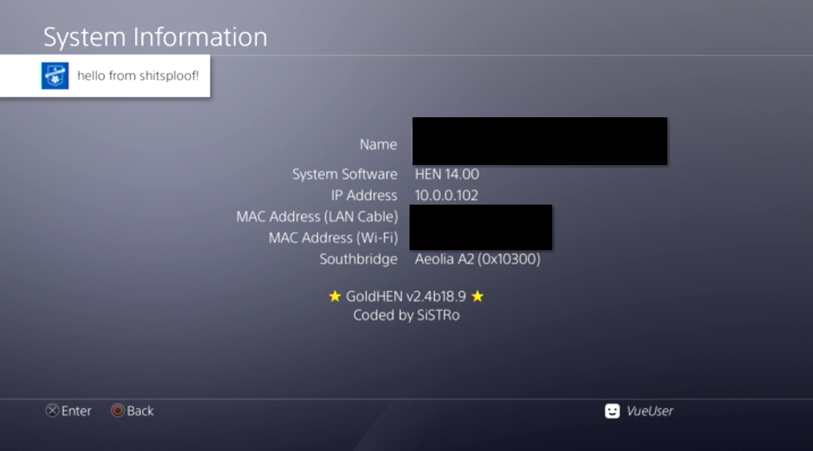
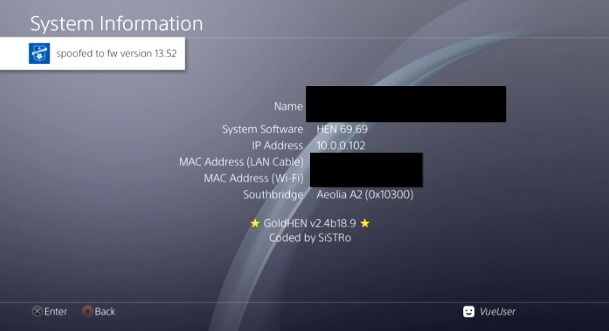

# shitspoof ps4
terrible terrible ai slop ps4 spoof script repurposed to ask questions, rather than rewriting the script. also doesn't search for random things in memory.
spoofs your ps4 firmware version. resets upon rest mode/shutdown.
works on ps4 firmware ?-13.00

# thanks:
random unnamed ai guy: AI is terrible and since you didn't write a single thing, but an AI did this is an untruthful thanks (fuck ai)
andrew2007: testing and baring through my bullshit, being a cool guy
me: i didn't do much, and i'm not very proud of this script, please don't bully me for editing some ai slop into a slightly usable script :(

# dependencies:
python3, ps4debug. you will need to load ps4debug.bin from https://github.com/GoldHEN/ps4debug to the console and also `pip install ps4debug`

# tutorial:
`python shitspoof.py`
everything prompts you very self explanatory yes

# proofs:

